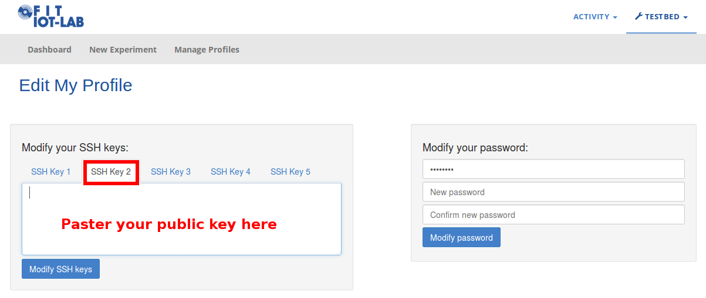

# FIT IoTLab Tesbed Tutorial

## Prerequisites
In order to use SSH, find your public key or create a new public key pair. Further information
can be found here:

- [Linux](https://www.maketecheasier.com/generate-public-private-ssh-key/)
- [Windows](https://www.codeenigma.com/host/faq/how-do-i-create-ssh-public-key-windows-pc)

You will get a `login` and `password` for the IoTLab testbed by the supervisor. With that account, log in to the website:

[https://www.iot-lab.info/testbed/](https://www.iot-lab.info/testbed/)

In the upper right of the window click on *Testbed->Edit my profile*. In the left box select *SSH Key 2*, paste your key and click on *Modify SSH keys. That's it!

## Tasks

###[Task 1](https://github.com/inetrg/FIT-IoT-Lab-Tutorial/tree/master/task1)
- Experiment submission via web portal
- Creation and use of consumption monitoring profiles
- Basic exploration of the CLI tools and serial aggregation of multiple nodes
- RIOT shell including sensor/actor abstractions and plain link layer communication

###[Task 2](https://github.com/inetrg/FIT-IoT-Lab-Tutorial/tree/master/task2)
- Creation and use of sniffer monitoring profiles and the sniffer aggregator tool
- Building a multi-hop network with RIOT RPL
- Pinging the global IPv6 address of distant nodes
