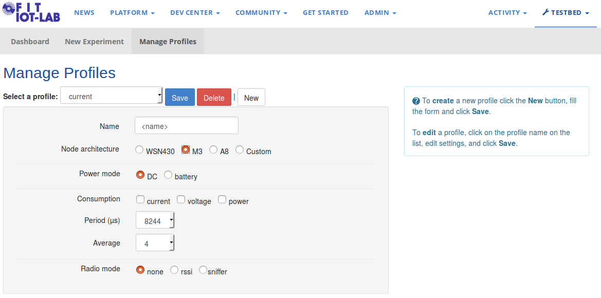
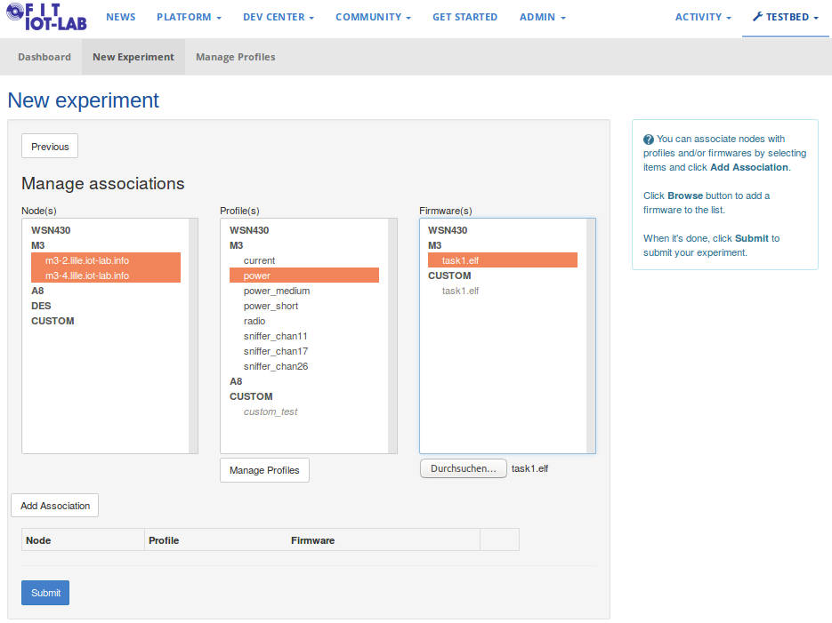
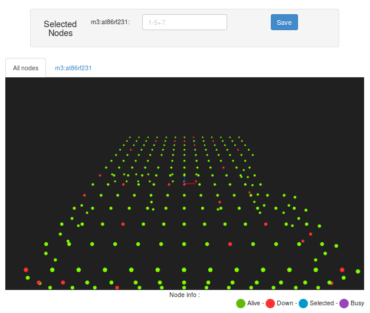
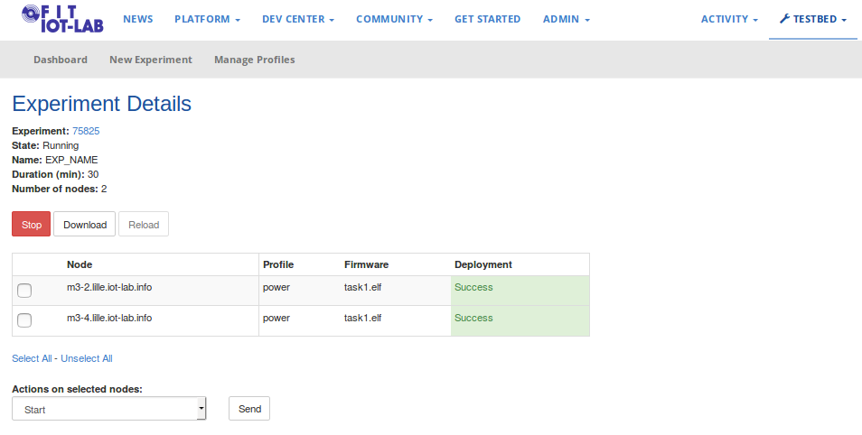

# Task 1

## Task 1.x Create a Power Monitoring Profile

The testbed provides you with a power measurement tool. In more detail, each node of an experiment is managed by its control node which, among others, monitors the node consumption. For later use you need to create a *profile* first which sets the configuration. In the web portal click on *Testbed->Manage Profiles->New* and create a profile for Node architecture M3. Don't forget the `<name>` that you give!

For detailed information check the [FIT IoT-Lab Tutorials website](https://www.iot-lab.info/tutorials/monitor-consumption-m3-node/)

## Task 1.x Submit an Experiment via Web Portal

Click on *New Experiment*. Give your Experiment a speaking name and set the duration at 30 minutes.

Below you find a list of all testbed sites. We will deploy this experiment on the Lille site. Here, all nodes are in one broadcast range. Click on *Lille map* and explore the arrangement and status of all nodes.

Green nodes indicate active status. By clicking on one node, you select it. Get two nodes and click on *Save*. Back to the submission window you should see the selected nodes listed for Lille. Click on *Next*. Select both M3 nodes in the left column, your profile `<name>` ("power" in the figure below) in the mid column and upload the provided RIOT firmware [task1.elf](../firmware/task1.elf) in the right column.

*Add Association* and  *Submit*. This might take a short moment. Once submitted you get information pop-up which also indicates the unique Experiment ID. Click *Close* and you will be redirected to the *Dashboard* which lists all recent experiments done with your account (none by now). You can click on the experiment to get all information.

For detailed information check the [FIT IoT-Lab Tutorials website](https://www.iot-lab.info/tutorials/submit-an-experiment-with-web-portal-and-m3-nodes/)

## Task 1.x Explore the CLI tools

The testbed provides you with a set of command line tools ([CLI tools](https://github.com/iot-lab/iot-lab/wiki/CLI-Tools)) which enables you to interact with the platform and to script experiments. Tools are available on front-end hosts and as a package that can be installed. Open a terminal window, connect via SSH (as described above) and test them by getting your experiment details:

`experiment-cli get -i <EXP ID> -r`

Front-end contain additional command line tools such as the [serial aggregator](https://www.iot-lab.info/tutorials/nodes-serial-link-aggregation/) which gives you access the serial link of all the nodes of your experiment at once. 

For detailed information check the [FIT IoT-Lab Tutorials website](https://www.iot-lab.info/tutorials/nodes-serial-link-aggregation/)

Next, access the serial links of your experiment with

`serial_aggregator -i <EXP ID>`

and explore the RIOT shell. By prefixing shell commands with `m3-<NODE ID>;` you are able to access a single node. Try RIOTs `help` command which shows you the features of the firmware and UNIX like `ps` command.

## Task 1.x RIOT Read/Write Sensors/Actuators

RIOT's [SAUL](https://riot-os.org/api/group__drivers__saul.html) API ([S]ensor [A]ctuator [U]ber [L]ayer) simplifies and generalizes device access. Explore the M3 hardware ressources. 

`saul` lists all SAUL ressources of that device with an ID, a generic device class and the specific name. The class of a device is prefixed with **ACT_** and **SENSE_** fot actuators and sensors.

`saul read <device id>` reads all sensor values. Get some sensor values to explore the environment. When sensing the temperature, be aware that the specific M3 nodes get warm during operation which is obviosly not intended.

`saul write <device id> <value 0>` gives you access to the three I/Os where the on-board LEDs are connected to. The LEDs are enabled by default. (i). Disable all three of them and 2. play around a bit by turning some on and off. We will see the consumption in our power profile later. **Please note** the LEDs are driven bei Vcc, so you need to **set** the I/O to **disable** the LED.

## Task 1.x RIOT Communicate with Neighbors

The submitted example contains link layer communication capabilities over the build-in 802.15.4 radio which implements RIOT's generic network device abstracion API [netdev](https://riot-os.org/api/structnetdev__driver.html). 

`ifconfig` is a UNIX like shell utility for network interface configuration. Explore the output of that command which shows you parameters such as MAC addresses, radio channel or the interface number.

`txtsnd <if> [<L2 addr>|bcast] <data>` lets you send plain text over the network interface. Use this command to send messages between different nodes.

## Get the Power Measurement

To look at the power consumption graph, connect to the SSH fronted with X11Forwarding

`ssh -X <login>@<site>.iot-lab.info` .

The raw data is stored in a file located on the front-end host at `~/.iot-lab/<EXP ID>/consumption/m3-<NODE ID>.oml`. You can use the *oml_plot* tool to visualize the consumption graphs over time:

`plot_oml_consum -p -i ~/.iot-lab/<EXP ID>/consumption/m3-<NODE ID>.oml`

Note that it might take a while until the graph is displayed. Once ready, you should see LED toggeling as previously done.

For detailed information check the [FIT IoT-Lab Tutorials website](https://www.iot-lab.info/tutorials/monitor-consumption-m3-node/)

