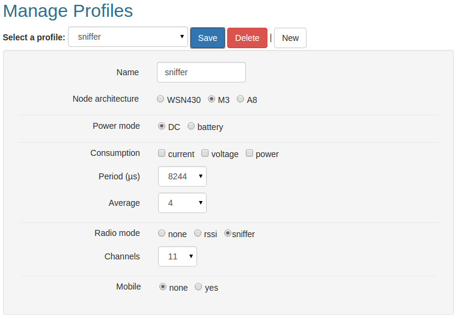
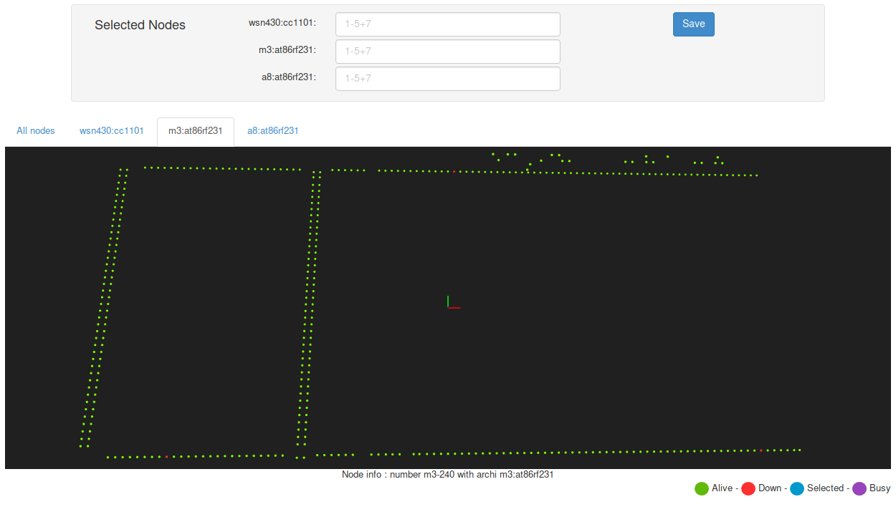

# Task 2

## Task 2.1 Create a Radio Sniffer Profile

For this task you need to create a radio sniffer profile.
This step is similar to [Task 1.1](https://github.com/inetrg/FIT-IoT-Lab-Tutorial/tree/master/task1):Choose the M3 *node architecture*,
leave the *power mode* setting as is (DC) and choose the *sniffer* option
for the *radio mode*.



For detailed information check the [FIT IoT-Lab Tutorials website](https://www.iot-lab.info/tutorials/radio-sniffer/)


## Task 2.2 Submit an Experiment via Web Portal

To test communication in a multi-hop scenario, you need to submit an experiment
with nodes that do not share a common broadcast range. The previously used
Lille site is not suitable, because all nodes are in a broadcast range.

For this task, you will explore the Grenoble site. Similar to [Task 1.2](https://github.com/inetrg/FIT-IoT-Lab-Tutorial/tree/master/task1),
create a new experiment, but this time choose 7–10 nodes from the *Grenoble map*
with a distance of ~3–5 nodes in between of each. You can choose the
*m3:at86rf231* filter on the upper part of the map to only see the m3 nodes.



This time, add an association of **one** m3 node with the sniffer profile and the
RIOT firmware. Associate all other m3 nodes with the firmware only (without a profile).

For detailed information check the [FIT IoT-Lab Tutorials website](https://www.iot-lab.info/tutorials/submit-an-experiment-with-web-portal-and-m3-nodes/)


## Task 2.3 Start the Sniffer

Connect to the SSH frontend of Grenoble and authenticate with the IoTLab
infrastructure (if not done previously).
```sh
ssh <login>@grenoble.iot-lab.info
<login>@grenoble:~$ auth-cli -u <login>
```

Start the `serial_aggregator` in order to connect to the nodes.
Open a new window and again connect to the SSH frontend of Grenoble.
This new window will be used for sniffing.
The `sniffer_aggregator` is pre-installed on the ssh frontend and is used to
aggregate the sniffer output of one or more nodes into a *pcap* file.
When your experiment is running, then start the `sniffer_aggregator` for the
m3 node that you associated with the sniffer profile.
Replace *X* with the specific m3 <NODE ID> which runs the sniffing profile.
```sh
<login>@grenoble:~$ sniffer_aggregator -l grenoble,m3,X -o m3-X.pcap
```


## Task 2.4 Configure and start the Routing Protocol (RPL)

RPL is a routing protocol designed for constrained devices and RIOT
provides an implementation. A designated root node builds and maintains
a Destination Oriented Directed Acyclic Graph (DODAG) by propagating
multicast ICMPv6 packets on the control plane.

For this task, you will need to choose a node in your experiment as the
root node of the DODAG. A global IPv6 address must be configured on this
root node (e.g. *2001::1*) using the RIOT shell.
In the `serial_aggregator` the m3 <NODE ID> must be prefixed to issue a command
only to a specific node.
```
m3-X;ifconfig 7 add 2001::1
```

Afterwards, the routing protocol can be started on the root node with
and **InstanceID** of **1** and a **DODAGID** of **2001::1**:
```
m3-X;rpl root 1 2001::1
```

With the `rpl` shell command of RIOT you can observe RPL related information
on each specific node. In a multi-hop scenario you should observe an increasing
Rank number for each hop. The Rank is encoded as **R** in the `rpl` output
and increases in steps of **256**. The root node has the rank **256**.


## Task 2.5 Multi-hop Communication

When RPL is correctly configured and started, each m3 node should receive
a global IPv6 address derived from the **2001::/64** prefix. You can use the
ping shell command provided by RIOT to test the multi-hop communication.

Use `ifconfig` on a m3 node (A) to retrieve the actual global IPv6 address and then
use the `ping` command on another m3 node (B) that is multiple hops apart.
```
m3-B;ping6 <IPv6 address of A>
```

Once the multi-hop communication is verified with ping, you can send arbitrary
UDP packets with the `udp` command. For this, a UDP server must be started
on the receiver side using a specific port with the following command:
```
m3-A;udp server start <port>
```

The sender can then transmit UDP packets with an arbitrary string as payload
to that specific port using:
```
m3-B;udp send <global ipv6 address> <port> <payload>
```


## Get the Sniffer Output

The sniffer can be terminated with **Ctrl+C** and a **pcap** file is available
in the current working directory.

You can inspect the pcap file directly on the command line on the SSH frontend
using tshark:
```sh
tshark -r m3-X.pcap
```

Another way is to copy the **pcap** file to your local machine and load the
file into Wireshark for a graphical user interface.
```sh
your@yourpc:~$ scp <login>@grenoble.iot-lab.info:m3-X.pcap m3-X.pcap
your@yourpc:~$ wireshark m3-X.pcap
```

For detailed information check the [FIT IoT-Lab Tutorials website](https://www.iot-lab.info/tutorials/radio-sniffer/)
